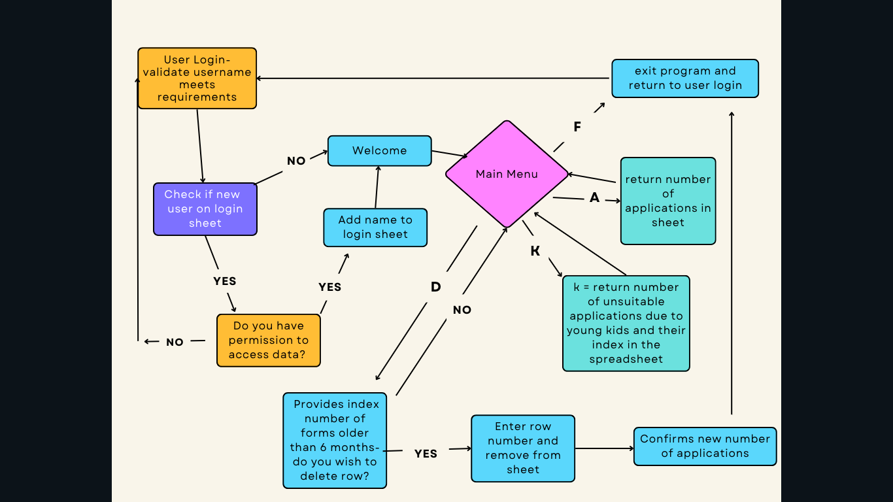

# **Adotion Form Manipulation**

The purpose of this project is to provide a simple, easy way for users to interact with a spreadsheet containing data from a google form. I currently volunteer with an animal rescue using this method for our rehoming but currently all data is manually changed in the spreadsheet. With GDPR records must be deleted after 6 months and certain applicants are unsuitable for homing. The aim of this project was to trial a method of allowing users to perform these tasks with less effort. 

[View the live project here](https://adoption-form.herokuapp.com/) 

## Contents                             1       2

* **[Design](#design)**
* **[User Experience](#user-experience)**
* **[Features](#features)**
   * Initial welcome screen and user-name input
   * New user or already user
   * Menu
   * Applications on system
   * Date management
   * Applicants with young kids
   * End session
* **[Future Features](#future-features)**
* **[Technologies Used](#technologies-used)**
* **[Testing](#testing)**
* **[Bugs](#bugs)**
* **[Validator Testing](#validator-testing)**
* **[Deployment](#deployment)**
* **[Credits](#credits)**

## Design

The google form is designed to collect basic data from potential adopters and colate this into a google sheet. The google form is [available here](https://forms.gle/c2WoRFhvzqWEH8nC6).

The program is designed to manipulate the data from the sheet collected from this form to make rehoming of dogs more steamline. Upon running the program, the user is prompted for a username. This is to ensure security of the program and all new users are recorded.

Tha colour scheme was chosen to make the text more easy to discern particularly in the menu which is text heavy and to highlight issues with a strong red background to the text. 

[Back to top](#contents)

## User Experience

#### First Time Users
 The goal for first time users is for the program to be easily understood. The user must confirm they have permission to access records and is informed that their name is saved. Any user entry issues are highlighted with a red background to make it clear where errors have been made. 

 #### Existing Users
 Existing users should also be able to quickly and easily navigate the program to manage records and monitor applications. 

 

## Features  
#### Initial welcome screen and user-name input
The inital welcome asks for a username to be entered and describes the correct input needed for this. It must be between 2 and 15 letters with only letters used. If a user enters anything not conforming with this an alert is raised and they are asked to enter correct name. Once a name that conforms with the requirements is entered, this is checked against a record of login sheet. If the user is already registered access is granted to the program. If th user is a new user they are asked if they have permission to access records. Again a yes or no is required so any other imputs raise an alert to the user. If the user answers yes their name is recorded to the sheet and they are granted access. If the user answers no they are returned to the welcome page. 

####  Menu

The menu page contains 4 options. Again these require specified inputs and anything apart from these will raise an error to the user.

The first item in the menu is to identify how many applications are on the system. This returns the number of applications on the system and returns you to the menu. 

The second allows you to see entries over 6 months old and their index in the spreadsheet. You are then asked if you wish to delete files again with only a y/n answer. Any other input will throw an error. If you select no you are returned to the menu. If yes is selected the index/row you wish to delete should be entered. This must be an integer and cannot be row 1 as this contains the title to the spreadsheet columns. In order to access the correct rows, 2 is added to the index numbers to account for the title page and the fact that sheets start at 1 not 0. Once the row is deleted the program logs out. With increased security and recording methods multiple deletes could be possible but due to the scope of this project one delete was only allowed to a user. 

The third option is to access applications with issues such as kids under 6. This gives the user return of the index of unsuitable applications due to young kids in the home. In future development these applications could be moved to another sheet or highlighted in the existing sheet to make management easier. 

The fourth option closes the program. 

## Features left to implement

Additional features could be to build out to include a more robust login method with a username and password and record of what occured with login. With this increased security more tasks could be performed for each user for example all applications over 6 months could be deleted. Applications could be highlighted or moved if they do not meet requirements. 

[Back to top](#contents)

## Technologies Used
* Python
* Gitpod
* GitHub
* Heroku
* Google Sheets
* Google Forms

## Libraries Used

* Colorama
* gspread
* google.oauth2.service_account
* datetime
* dateutil
* time

## Testing

I tested my code using [Python Checker](https://www.pythonchecker.com/). No errors were given. 

I performed several manual tests on all aspects of the program where user input is required. 

On the initial screen a username must be input. This must be between 2 and 15 letters with no other characters. To test this I entered a single letter, combined letters over 15 characters, letters and numbers, single numbers, letters and characters, single characters to ensure that errors were given in all instances. Error messages were given in all instaces and this appears to be functioning well. 

New users are asked if they have permission to access records. This is a simple y/n. Any other input should throw an error back to the user. This again was tested with a wide varity of letters, numbers and characters and appears to be functioning well. "y" should bring the user to the menu page and "n" should return to login page and all appears to be functioning. 

From the menu page only 4 options are given for input a/d/k/f. Again this was tested with multiple different combinations and all functioning. The respective letters lead to different areas of the program and this was seen on testing. 

Within the entry date management area there again is a y/n input question which was tested as above to ensure functionality. Another input asks then for an integer to delete a row. This must be an integer and this was tested as above with many different inputs to ensure only a single number can be entered. 

[Back to top](#contents)

## Bugs

There was initially an issue with the login name to check the sheet to see if a new or existing user. The code was only checking the first element of the column so existing users lower in the column were being treated as new users. This was due to repitition in the loop being set up as 'for data in data', once changed to 'for row in data' it functioned correctly. 

There was also initially an issue with adding the new users to the list. This was due to the program expecting a list input. Originally written as 'logins.append_row(name)' once changed to logins.append_row([name]) this was rectified and functioning. 

Another issue was formatting the time from the sheet correctly to compare with todays date and time. This was resolved by removing the time and having it stored as month/day/year [datetime.strptime(date, '%m/%d/%Y %H:%M:%S') for date in date_col[1:]]

separateing delete function from check date function as was repeating with each iteration
Adding 1 to index as not 0 indexed
Not recognising interger for input??
adding row in data rather than data in data resolved name spreadsheet issue. 

Date issues tried:
        # both = set(dates_list).intersection(old_data)
        # date_index =[dates_list.index(i) for i in both] 
        # needs +2 added for title and not 0 index, only returning 1 value!!

        # date_index = []
        # for i in old_data:
        #     if i in dates_list:
        #         for j in dates_list:
        #             if i == j:
        #                 if dates_list.index(i) not in date_index:
        #                     date_index.append(dates_list.index(i)+2)

https://stackoverflow.com/questions/51171314/find-indexes-of-common-items-in-two-python-lists
https://stackoverflow.com/questions/60825828/how-to-delete-column-by-user-input-in-excel-in-python-using-openpyxl
https://stackoverflow.com/questions/52696172/limiting-an-input-between-two-numbers-and-checking-if-the-input-is-a-number-or-n#:~:text=You%20can%20use%20a%20while,%22)

after delete row- does not update the data from spreadsheet- still shows deleted row fixed with exit()
https://pypi.org/project/colored/

[Back to top](#contents)

## Deployment

This project developed on Gitpod and commited and pushed to GitHub and then was deployed using Heroku. An app was created in Heroku using my project name and the region of Europe. Two buildpacks were added in the Settings tab in the order heroku/python and then heroku/nodejs. A Config Car of PORT set to 8000 is also added. Another Config Var called CREDS contains the cred.json contents. In the Deploy tab the method of deployment was through GitHub and GitHub repository was connected to Heroku. The deployement was set to automatic to update the site with each push to GitHub. The branch to deploy is master/main and the site was deployed. 

[Back to top](#contents)

## Credits

The love sandwiches project was used as a guide for setting the Heroku page up and API's.

Some comments from tutoring were also used to rectify issues with dateutil on Heroku and with user input issues. 

[Back to top](#contents)

Laura Walsh 2022

